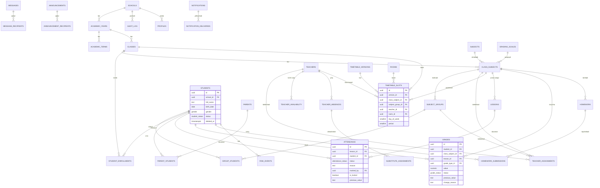

# SchoolOS Uzbekistan — Phase 0: Mahsulot va texnik arxitektura

> **Holat:** TASDIQLASH UCHUN. Bu hujjat tasdiqlangach — to'liq Supabase SQL migration, so'ngra Phase 1 (Admin) implementation boshlanadi.
> **Ishchi nom:** SchoolOS Uzbekistan (keyinchalik branding o'zgartirilishi mumkin).
> **Sana:** 2026-10-07 · **Muallif:** CTO/Arxitektura javobi

---

## Mundarija

1. [Joriy repo holati va migratsiya yo'li](#0-joriy-repo-holati-va-migratsiya-yoli)
2. [Mahsulot konsepsiyasi](#1-mahsulot-konsepsiyasi)
3. [eMaktab bilan funksional taqqoslash](#2-emaktab-bilan-funksional-taqqoslash)
4. [Nimani saqlaymiz](#3-nimani-saqlaymiz)
5. [Nimani yaxshilaymiz](#4-nimani-yaxshilaymiz)
6. [Nimani qo'shamiz (asoslangan takliflar)](#5-nimani-qo'shamiz-asoslangan-takliflar)
7. [Platforma modullari xaritasi](#6-platforma-modullari-xaritasi)
8. [Foydalanuvchi rollari](#7-foydalanuvchi-rollari)
9. [Permission matrix](#8-permission-matrix)
10. [Ma'lumotlar bazasi arxitekturasi](#9-malumotlar-bazasi-arxitekturasi)
11. [ERD](#10-erd)
12. [RLS arxitekturasi](#11-rls-arxitekturasi)
13. [Information architecture (marshrutlar va papkalar)](#12-information-architecture-marshrutlar-va-papkalar)
14. [Navigatsiya tuzilmasi](#13-navigatsiya-tuzilmasi)
15. [Asosiy ish oqimlari (minimum-click tahlili)](#14-asosiy-ish-oqimlari-minimum-click-tahlili)
16. [UI/UX dizayn tizimi](#15-uiux-dizayn-tizimi)
17. [Mobile UX](#16-mobile-ux)
18. [Offline arxitekturasi](#17-offline-arxitekturasi)
19. [Dars jadvali generatori arxitekturasi](#18-dars-jadvali-generatori-arxitekturasi)
20. [Bildirishnoma arxitekturasi](#19-bildirishnoma-arxitekturasi)
21. [Audit va tarix arxitekturasi](#20-audit-va-tarix-arxitekturasi)
22. [Xavfsizlik arxitekturasi](#21-xavfsizlik-arxitekturasi)
23. [Performance arxitekturasi](#22-performance-arxitekturasi)
24. [Development phases](#23-development-phases)
25. [Phase 0 implementation rejasi](#24-phase-0-implementation-rejasi)
26. [Risklar va tasdiq talab qiladigan qarorlar](#25-risklar-va-tasdiq-talab-qiladigan-qarorlar)
27. [Manbalar](#26-manbalar)

---

## 0. Joriy repo holati va migratsiya yo'li

Repoda allaqachon **prototip** bor: Next.js 15 + React 18 + TypeScript + Tailwind + Radix + Zustand + Supabase JS. Sahifalar: login, direktor/o'qituvchi/o'quvchi dashboardlari, o'quvchi wallet (PP ball o'tkazmalari), reyting, messenger, jadval + oddiy greedy jadval algoritmi (testlari bilan).

**Muhim xavfsizlik auditi xulosasi:**

| Joriy holat | Muammo | Yechim |
|---|---|---|
| `profiles.password` — ochiq matn, login brauzerda tekshiriladi | Production uchun YAROQSIZ | Supabase Auth (OTP/password) ga to'liq o'tish |
| Rol `localStorage`da saqlanadi | Istalgan rolga o'zinish mumkin | Rol server tomonida `profiles`dan, JWT bilan |
| `DEMO_SETUP.sql` — ataylab ochiq RLS (anon read/write) | URL+anon key olgan har kim ma'lumotni o'zgartiradi | Yangi sxema: har jadvalda RLS, tenant izolyatsiya |
| `school_id` yo'q, text PK (`D-100001`) | Multi-tenant emas | Yangi sxema: UUID PK, `school_id` hammada |
| Wallet/CP-ball/reyting yadroda | Spec bo'yicha gamification ixtiyoriy va chalg'itmasligi kerak | Feature flag ortiga ajratish (qaror **D7**) |

**Qaror (taklif):** Ma'lumotlar qatlami **noldan qayta quriladi** (yangi multi-tenant sxema, Supabase Auth, RLS). Mavjud UI — dizayn reference va qayta ishlatiladigan komponentlar manbai. `timetableAlgorithm.ts` — v0 prototip, generator bosqichma-bosqich constraint-based arxitekturaga ko'tariladi (§18). Joriy demo ma'lumotlar — bir martalik, yangi sxemaga ko'chirilmaydi.

---

## 1. Mahsulot konsepsiyasi

### 1.1 Bir jumlali viziya

> **"Maktab bir oynadan boshqariladi. O'qituvchi jurnalni 10 soniyada to'ldiradi. Ota-ona izlamaydi — xabar o'zi keladi."**

### 1.2 Pozitsiya

Bu loyiha eMaktab'ning **nusxasi emas**. eMaktab'dagi zarur imkoniyatlar (jurnal, davomat, baho, uy vazifasi, jadval, ota-ona kabineti) saqlanadi, lekin mahsulot ustunligi **funksiya sonida emas**, quyidagida:

> **"Biz maktab ishini keskin osonlashtiramiz."**

### 1.3 North-star metrikalar (har faza shularni yaxshilaydi)

| Metrika | Maqsad |
|---|---|
| Davomat belgilash (30 o'quvchi, sinf) | **< 10 soniya**, ≤ 4 bosish |
| Baho kiritish (sinf bo'yicha) | Keyboard-first, katta kataklar, autosave |
| O'quvchi topish | **< 3 soniya** (Ctrl+K yoki qidiruv) |
| Direktorning "bugun nima bo'lyapti?" javobi | **0 bosish** (login → dashboard) |
| Ota-onaning "bugun farzandim..." javobi | **0–1 bosish** (push → ilova) |
| Keng tarqalgan admin amallari | **≤ 3 interaksiya** |

### 1.4 Persona va ularning bitta savoli

| Rol | Birinchi ekranda javob beriladigan savol |
|---|---|
| Direktor | "Bugun maktabda hammasi joyidami?" |
| Sinf rahbari | "Sinfimda muammo bormi?" |
| O'qituvchi | "Bugungi darslarim va jurnal" |
| Ota-ona | "Farzandim bugun nima qilmoqda?" |
| O'quvchi | "Bugun qanday darslar, uy vazifasi bor?" |

### 1.5 Asosiy prinsiplar (qisqartirilgan)

1. Minimum clicks — har amal 1–3 bosish
2. Mobile-first, slow-internet-friendly (2G/3G'da o'qituvchi workflow ishlaydi)
3. Offline-first (jurnal) where appropriate
4. Secure by default — RLS majburiy, frontend check faqat UX
5. Multi-tenant — `school_id`, boshqa maktab ma'lumotini DB darajasida ko'rib bo'lmaydi
6. Audit everything important
7. Smart defaults + pre-fill — tizim xavfsiz xulosa qilgan narsani so'ramaydi
8. Oddiy til — texnik xato matnlari emas, odam tili
9. Undo mumkin joyda, destructive amalga confirm + audit
10. Feature creep yo'q — har yangi funksiya §5 dagi asoslashdan o'tadi

### 1.6 Non-goals (Phase 1–6 da QILINMAYDI, faqat arxitektura tayyor)

To'lovlar, transport, kutubxona, tibbiyot, HR/isitohona, LMS, to'garaklar, AI (mustaqil modul sifatida), Telegram bot (Phase 9), gamification (D7 qarorigacha). Bular `school_features` (feature flags) orqali keyinchalik yoqiladi — yadro qayta yozilmasdan.

---

## 2. eMaktab bilan funksional taqqoslash

### 2.1 eMaktab'da nima bor (manbalarda tasdiqlangan)

| Imkoniyat | eMaktab |
|---|---|
| Elektron jurnal/kundalik | Fan jurnali: baho, davomat, uy vazifasi, dars mavzusi kiritish |
| Dars jadvali | Onlayn jadval yaratish va yuritish |
| Ota-ona kabineti | "eMaktab.Oila" ilovasi: 24/7 baho/UVM kirish, joriy dars, fanlar bo'yicha reyting, o'rtacha ball, ertangi kun vazifalari |
| O'qituvchi mobil | "eMaktab.Jurnal" ilovasi, **offline** baho qo'yish/UVM belgilash |
| Hisobotlar | Ta'lim tashkilotlari va organlariga statistik hisobotlar |
| Maktab profili | Maktab profili, sinf xonalari, jadval yuritish |
| Auth modeli | Maktab tarqatgan login/parol; parolni tiklash — sinf rahbari orqali |
| Monetizatsiya | Ota-onalar uchun **PRO obuna** (to'lov devori) |

### 2.2 Funksional taqqoslash jadvali

| Soha | eMaktab | SchoolOS | Ustunlik tur |
|---|---|---|---|
| Auth | Login/parol tarqatish, sinf rahbari orqali tiklash | Telefon + OTP (ota-ona/o'quvchi), parolsiz | **UX + xavfsizlik** |
| Davomat | Har o'quvchini belgilash | "HAMMASI KELDI" + faqat istisnolar | **Tezlik (10s)** |
| Baho kiritish | Formalar | Excel-uslubli grid, klaviatura, autosave, offline queue | **Tezlik** |
| Jadval | Qo'lda/asosiy | Constraint-based generator + tushuntirish + drag&drop validation | **Avtomatlashtirish** |
| Navigatsiya | Ko'p menyuli | Rol-asosida qisqargan, "Bugun" bosh ekran | **UX** |
| Ota-ona | Kundalik monitoring, PRO devori | Push-first: xabar o'zi keladi; monitoring ikkinchi darajali | **UX + narx** |
| Offline | Jurnal ilovasida baho/UVM | Offline + sync queue + conflict UI + davomat mavzusi | **Ishonchlilik** |
| Qidiruv | Cheklangan | Ctrl+K global, fuzzy, RLS-aware | **UX** |
| Bulk amallar | Cheklangan | Import wizard, bulk promote/assign/message/export | **Avtomatlashtirish** |
| Analytics | Organ statistikasi | Direktor uchun actionable dashboard, drilldown, risk | **Ko'rinish** |
| Audit | Cheklangan | Hamma muhim amal immutable audit + tarix | **Ishonch** |
| Almashtirish | Qo'lda | Avtomatik taklif + ranking | **Avtomatlashtirish** |

**E'tibor:** eMaktab'da offline rejim allaqachon bor (Jurnal ilovasida). Shuning uchun bizning offline maqsadimiz "offline bor" emas — **chuqurroq offline** (davomat + baho + mavzu + conflict resolution + sync status).

### 2.3 Boshqa platformalar tahlili (konseptual xulosa)

| Platforma | Kuchli tomoni (olamiz) | Zaif tomoni (olmaymiz) |
|---|---|---|
| OpenEduCat (Odoo-based) | Modulli tuzilish, imtihon/kutubxona kengaytirilishi | ERP murakkabligi, o'rnatish og'irligi |
| OpenSIS / "OpenSchool" oilasi | SIS asoslari: scheduling, gradebook, hisobotlar | Eskirgan UX, ko'p forma, kam mobil |
| Zamonaviy School MIS (Bromcom/SIMS avlodi) | Actionable analytics, alerting, data quality | Enterprise narx/murakkablik |
| Zamonaviy timetable engine'lar (FET va h.k.) | Qattiq/yumshoq constraint modeli, score | Faqat jadval — maktab workflow'i bilan bog'lanmaydi |
| Google Classroom | Soddalik, "topshiriq → topshirish" oqimi | Boshqaruv (davomat/hisobot) yo'q |
| Kundalik.com (MDM) | Keng funksiya, ota-ona portal | Chuqur menyular, parol modeli |

**Xulosa:** Biz — MIS'ning data mustahkamligi + Classroom'ning soddaligi + offline ishonchliligining uyg'unligi, O'zbekiston kontekstida (til, chorak, 5-ball, mahalliy SMS/Telegram realiteti).

---

## 3. Nimani saqlaymiz

eMaktab'da mavjud **kontseptsiyalar** saqlanadi (implementation yaxshilanadi):

1. Elektron sinf jurnali (fan bo'yicha, dars mavzusi bilan)
2. Darsbay davomat belgilash
3. Baholar: kunlik + chorak/yakuniy
4. Uy vazifasi berish va kuzatish
5. Dars jadvali (sinf/o'qituvchi/xona ko'rinishlari)
6. Ota-ona kundaligi (baho, davomat, UVM ko'rish)
7. Bildirishnomalar (kelmadi, yangi baho, UVM)
8. Maktab profili va sinf xonalar reyestri
9. Statistik hisobotlar
10. O'qituvchi offline jurnal kontseptsiyasi

---

## 4. Nimani yaxshilaymiz

Har bir qator: **muammo → yechim → o'lchanadigan natija**.

| # | Muammo | Yechim | Natija |
|---|---|---|---|
| 1 | Parol tarqatish va sinf rahbariga yuk | Telefon + OTP; parolsiz ota-ona/o'quvchi | Sinf rahbari "parol bo'limi" bo'lib qolmaydi |
| 2 | Chuqur menyular | Rol-asosida "Bugun" bosh ekrani, menyu avtomatik qisqaradi | 1 tap — kerakli ekran |
| 3 | Davomat: 30 ta katak | "HAMMASI KELDI" + istisnolar + autosave | 30 o'quvchi ≈ 10 soniya |
| 4 | Baho: modal/forma | Spreadsheet grid: Enter/Tab/arrov, fill-down, undo, autosave | Sinf baholari 1 daqiqada |
| 5 | Ota-ona: o'nlab menyu | Bosh ekran "Bugun" + avtomatik push | Ma'lumot o'zi keladi |
| 6 | Qidiruv: ko'p bosqich | Ctrl+K global fuzzy search (o'quvchi/o'qituvchi/sinf/...) | < 3 soniya |
| 7 | Import: qo'lda yozish | Wizard: yuklash → ustun aniqlash → mapping → validate → preview → xatoni tuzatib qayta | 500 o'quvchi — texnik bilimsiz |
| 8 | Jadval: qo'lda | Generator (constraint-based) + "negа joylashmadi" tushuntirishi + drag&drop real-time validation | Soatlar tejamkorligi |
| 9 | Texnik xatolar | "Nima bo'ldi / nega / nima qilish kerak" formati | Kamroq qo'ng'iroq |
| 10 | Yakka-yakka amallar | Bulk: ko'chirish, biriktirish, xabar, eksport | 300 o'quvchi 1 amalda |
| 11 | "Kim o'zgartirdi?" — javobsiz | Immutable audit + temporal tarix | Ishonch va nizolarni hal qilish |
| 12 | Bo'sh/chiroyli dashboard | Actionable KPI: har raqam bosiladi → filtrlangan ro'yxat | Dashboard = ish ro'yxati |
| 13 | Onboarding yo'q | 8 qadamli setup wizard + School Health checklist | Birinchi kuni ishlash |
| 14 | Ota-ona uchun to'lov devori (PRO) | Default: ota-ona uchun devor yo'q (biznes-model qarori — **D3-eslatma**) | To'liq qamrov |

---

## 5. Nimani qo'shamiz (asoslangan takliflar)

Har qaysi yangi funksiya 6 mezonda asoslanadi. **Feature creep himoyasi:** bu ro'yxatdan tashqari hech narsa Phase 1–6 ga qo'shilmaydi.

| # | Funksiya | Nima uchun / kim | Qaysi workflow'ni yaxshilaydi | DB ta'siri | Security ta'siri | UX ta'siri |
|---|---|---|---|---|---|---|
| 1 | **"Bugun" smart dashboardlar** (har rol uchun actionable KPI + drilldown) | Direktor/sinf rahbari kunni 1 ekranda ko'radi | "Bugun nima qilish kerak?" → action list | `daily_summaries` agregat jadvali | RLS bilan filtrlangan | 0 bosishdan holat |
| 2 | **One-tap davomat** ("Hammasi keldi") | O'qituvchi, dars vaqtida | 30 kishilik davomat 10 soniyada | Yo'q (mavjud attendance) | Yo'q | Asosiy ustunlik |
| 3 | **Data Quality Center + School Health** | Admin — "nima noto'g'ri" ko'rsatkichi | Toza data, kam xato | `data_quality_issues` | Faqat o'z maktabi | Checklist psixologiyasi |
| 4 | **At-risk engine** (rule-based, izohlanadigan) | Sinf rahbari/direktor erta ogohlantirish | 3 ketma-ket sababsiz → avtomatik alert | `risk_rules`, `risk_events` | RLS; AI emas — oddiy qoidalar | Har risk sabablari bilan |
| 5 | **Hujjat paketi avtomatik** (3-soat sababsiz hujjatlari) | Sinf rahbari qog'oz ishi kamayadi | Ariza/ma'lumotnoma avtomatik to'ldiriladi, admin review bilan | `document_templates`, `documents` | Rasmiy yuborishga human gate | Bir tugma |
| 6 | **Almashtiruvchi taklifi** | Direktor/jadval mas'uli | Kasal o'qituvchi → rank qilingan nomzodlar | `teacher_absences`, `substitute_assignments`, `timetable_exceptions` | Faqat admin biriktiradi | 1 tugma |
| 7 | **Xabar shablonlari + ish vaqti** | O'qituvchi/sinf rahbari | "Bugun kelmadi" — 1 click; 22:00 da yuborilsa — navbatga | `message_templates` | Working hours policy | Navbat indikatori |
| 8 | **Command palette (Ctrl+K)** | Advanced userlar | Har qanday amal 3 bosishda | Yo'q (search ustida) | RLS-aware qidiruv | Kuchli UX signali |
| 9 | **Automation engine** (WHEN→THEN, sozlanadigan) | Admin avtomatlashtirish | Sababsiz→parent notify va h.k. | `risk_rules` (umumlashtirilgan) | Har action audit | Kamroq qo'lda ish |
| 10 | **Telegram bildirishnomalar** (flag) | Ota-ona bepul kanal | SMS xarajatisiz yetkazish | `telegram_accounts` | Faqat read-only | O'zbekistonda tabiiy |
| 11 | **AI yordamchi** (flag, Phase 8) | Direktor tushuntirish/summary | "Bugun muammo bormi?" | Yo'q (o'qish qatlami) | RLS bypass taqiqlangan; faqat ko'riladigan data | Optional, alomatlanadi |

**Ataylab QO'SHILMAYDIGANLAR (Phase 7+ flag):** to'garaklar, transport, kutubxona, tibbiyot, psixolog moduli, HR, to'lovlar, LMS, alumni, ovozli chat, "ijtimoiy tarmoq" elementlari. Sabab: §1.6 non-goals — yadro soddaligini saqlash.

---

## 6. Platforma modullari xaritasi

```
SchoolOS
├── PLATFORMA YADROSI (Phase 0)
│   ├── Tenancy (schools, school_settings, school_features)
│   ├── Auth & Sessions (Supabase Auth, user_sessions)
│   ├── Profiles & Permissions (profiles, permissions)
│   ├── Audit (audit_log)
│   ├── i18n (uz/ru)
│   └── Feature flags
├── ASOS (Foundation) (Phase 1)
│   ├── Academic years & terms & calendar
│   ├── People: students / parents / teachers (+relationships)
│   ├── Sinflar, fanlar, class_subjects
│   ├── Guruhlar (subject_groups, group_students)
│   ├── Xonalar (rooms)
│   └── Teacher assignments & availability
├── OPERATSIYA (Phase 1–2)
│   ├── Timetable (generator, versions, editor, exceptions, substitutes)
│   ├── Journal (lessons, attendance, grades, grading config)
│   └── Homework (+submissions)
├── ALOQA (Phase 2–4)
│   ├── Messages (+templates, working hours)
│   ├── Announcements
│   └── Notifications (preferences, deliveries, push/Telegram/SMS)
├── TUSHUNCHA (Insight) (Phase 6–7)
│   ├── Reports & Export
│   ├── Director analytics
│   ├── Risk engine
│   └── Data Quality Center
├── YOZUVLAR (Records) (Phase 1+)
│   ├── Documents & templates
│   ├── Import / Export jobs
│   └── History (temporal)
└── KELAJAK MODULLARI (flag, Phase 7+)
    └── clubs, transport, library, medical, HR, payments, wallet/gamification, AI, Telegram bot
```

---

## 7. Foydalanuvchi rollari

Rol = **permission bundle** (har bir rol permissionlar to'plami; school darajasida override mumkin).

| Rol | Tavsif | Asosiy qobiliya | Faza |
|---|---|---|---|
| `SUPER_ADMIN` | Platforma egasi | Maktablar, feature flags, tizim salomatligi; maktab personal datasiga **default kirish yo'q** (break-glass + audit) | 0 (minimal) |
| `ADMIN` | Maktab ma'muriyati | Maktab bo'yicha to'liq CRUD, import/eksport, sozlamalar | 0–1 |
| `DIRECTOR` | Direktor | ADMIN bilan bir xil ko'rish + barcha hisobotlar; o'zgartirishlar adminativ rol bilan birga | 1 |
| `CLASS_TEACHER` | Sinf rahbari (o'qituvchi + qo'shimcha) | O'z sinfi: to'liq davomat override, xabar, hujjat paketi, sinf statistikasi | 1–2 |
| `TEACHER` | Fan o'qituvchisi | Faqat biriktirilgan sinf/guruhlar: jurnal, baho, UVM, cheklangan o'quvchi ma'lumoti | 2 |
| `PARENT` | Ota-ona/vasiy | Faqat o'z farzand(lar)i: davomat, baho, UVM, e'lon, xabar | 3 |
| `STUDENT` | O'quvchi | Faqat o'zi: jadval, baho, UVM, davomat | 3 |

**Kelajak rollari (arxitektura tayyor, permission bundle sifatida qo'shiladi):** PSYCHOLOGIST, LIBRARIAN, NURSE, HR_OFFICER, ACCOUNTANT, TRANSPORT_MANAGER, DEPUTY_DIRECTOR, DISTRICT_ADMIN, REGION_ADMIN.

---

## 8. Permission matrix

**Muhim:** Frontend permission check — faqat UX (menyu tugash). **Haqiqiy security — PostgreSQL RLS** (§11) va server action pipeline (§21).

### 8.1 Permission katalogi (asosiy)

```
students.view / create / update / archive / export_pii
parents.view / create / update / export
teachers.view / create / update / export
classes.view / manage
subjects.view / manage
groups.manage
rooms.manage
assignments.manage                 # teacher_assignments
attendance.view / mark / override / lock_manage
grades.view / enter / publish / override
gradebook.config                   # grading scales
homework.view / assign / check
timetable.view / edit / generate / publish
substitutes.manage
messages.send / templates.manage
announcements.send
reports.view / export / build
documents.view / upload / templates.manage
import.run / export.run
audit.view
risk.view / rules.manage
settings.manage / features.manage
```

### 8.2 Rol × Resource matrix

| Resource | ADMIN/DIRECTOR | CLASS_TEACHER | TEACHER | PARENT | STUDENT |
|---|---|---|---|---|---|
| Students | To'liq CRUD + eksport | O'z sinfi: view + cheklangan edit | Biriktirilgan sinflar: view (cheklangan maydonlar) | O'z farzandi: view | O'zi: view |
| Parents | To'liq | O'z sinfi: view (telefon) | Yo'q | O'zi: view/edit o'z kontakti | Yo'q |
| Teachers | To'liq | View | O'zi: view | Yo'q (umumiy ma'lumot) | Yo'q |
| Attendance | View all + override + lock | O'z sinfi: view + override (sabab bilan) | Biriktirilgan darslar: mark + 24s ichida edit | O'z farzandi: view | O'zi: view |
| Grades | View all + override | O'z sinfi: view | Biriktirilgan: enter/publish | O'z farzandi: view (published) | O'zi: view (published) |
| Homework | View all | O'z sinfi: view | Biriktirilgan: assign/check | O'z farzandi: view + submit | O'zi: view + submit |
| Timetable | Manage + generate + publish | View | View + darslarini ko'rish | O'z farzandi jadvali | O'z jadvali |
| Messages | Barchaga yuborish | Sinf ota-onalariga + sinfga | O'z sinf ota-onalari/individual | O'z farzand o'qituvchilari | O'z o'qituvchilari |
| Reports/Export | To'liq (PII eksporti alohida ruxsat) | O'z sinfi | Cheklangan | Yo'q | Yo'q |
| Audit | View (o'z maktabi) | Yo'q | Yo'q | Yo'q | Yo'q |
| Settings | Manage | Yo'q | Yo'q | O'z notification pref | O'z notification pref |
| Documents | To'liq | O'z sinfi: view/yuklash | Yo'q | O'z farzandiniki: view | O'ziniki: view |
| Data quality / Risk | View + manage | O'z sinfi: view | Yo'q | Yo'q | Yo'q |

**PII eksporti alohida permission** (`students.export_pii`): oddiy o'qituvchi butun maktab o'quvchi ma'lumotini eksport qila olmaydi.

---

## 9. Ma'lumotlar bazasi arxitekturasi

### 9.1 Dizayn qarorlari

| Qaror | Tanlov | Asos |
|---|---|---|
| PK | `uuid` (`gen_random_uuid()`) | Taqsimlangan ID, URL-safe, join qulay |
| Tenant | Har maktab jadvalida `school_id uuid not null` + RLS | DB darajasida izolyatsiya |
| Vaqt | `timestamptz` (UTC saqlash), UI `Asia/Tashkent` (school timezone sozlanadigan) | Yozgi/qishki vaqt muammosiz |
| Sanalar | `date` (tug'ilgan sana, dars sanasi) | Vaqt zonasidan mustaqil |
| Enumlar | Postgres `enum` — faqat tizim-fixed qiymatlar (rol, attendance status); **maktab sozlaydigan qiymatlar — lookup jadvallar** (grading scales, grade types, davomat sabablari) | Davlat talablari o'zgarsa schema emas, konfiguratsiya o'zgaradi |
| Soft delete | Muhim entitylarda `status` + `deleted_at` | Tarix yo'qolmaydi |
| Tarix | 3 mexanizm (quyida §9.4) | Har tur uchun to'g'ri vosita |
| Search | `pg_trgm` GIN indekslari + normalized isim maydoni | Fuzzy o'zbek ismlari ("Hakimov" ≈ "Hakimo v") |
| Idempotentlik | Mutationlarda `client_uuid unique` (offline sync uchun) | Qayta sinxronlashda dublikat yo'q |

### 9.2 Jadval katalogi (guruhlangan, ~58 jadval)

**Platforma yadrosi**

| Jadval | Maqsad (asosiy ustunlar) |
|---|---|
| `schools` | Tenant ildizi: nom, tip, manzil, telefon, logo, timezone, branding (jsonb), status |
| `school_settings` | Kalit-qiymat (jsonb) sozlamalar: ish vaqti, messaging hours, davomat lock muddati, hujjat threshold'lari |
| `school_features` | Feature flags per maktab (telegram, ai, wallet, ...) |
| `academic_years` | `2026/2027`, start/end, aktiv flag |
| `academic_terms` | Choraklar/semesterlar: tur, raqam, start/end |
| `calendar_events` | Bayram, ta'til, imtihon, tadbir, yig'ilish (type, date/range, sinf scope) |
| `lesson_periods` | Smena va dars vaqtlari: smena, raqam, start_time, end_time |
| `profiles` | `auth.users` 1:1: school_id, rol, F.I.Sh., telefon, avatar, status |
| `roles` / `permissions` / `role_permissions` | Permission bundle model (rol → permissionlar) |
| `user_sessions` | Sessiya/qurilma ro'yxati (logout all, suspicious detection) |
| `audit_log` | Immutable audit (§20) |

**Odamlar**

| Jadval | Maqsad |
|---|---|
| `students` | O'quvchi yadro entitysi: F.I.Sh., birth_date, jins, status (active/inactive/graduated/transferred/archived), tashqi ID, minimal PII |
| `student_enrollments` | Sinf a'zoligi — **temporal**: student, class, academic_year, valid_from/valid_to (sinfdan sinfga ko'chirish tarixi shu yerda) |
| `parents` | Ota-ona: F.I.Sh., telefon (unique-ish), manzil — **temporal maydonlar tarixi bilan** |
| `parent_student` | Vasiylik: parent, student, relationship (mother/father/guardian/other), can_view_*, **temporal shartnoma (contract) maydonlari tarixi bilan** |
| `teachers` | O'qituvchi: F.I.Sh., telefon, email, status |
| `teacher_assignments` | Biriktirish — **temporal**: teacher, class_subject, group?, academic_year, hours_per_week, valid_from/to |
| `teacher_availability` | Bo'sh/band kun-vaqt (day, period, available/blocked) |
| `teacher_absences` | Kasal/yo'q holatlar (date, reason) |
| `substitute_assignments` | Almashtirish: absence, slot, substitute teacher, holat |

**O'quv tuzilmasi**

| Jadval | Maqsad |
|---|---|
| `classes` | Sinf: nom (10-A), parallel, o'quv yili konteksti `class_teacher_assignments` orqali |
| `class_teacher_assignments` | Sinf rahbari — temporal (class, teacher, year, valid_from/to) |
| `subjects` | Fan: nom, qisqa nom, kategoriya, active |
| `class_subjects` | Sinf×fan×yil: haftalik soat, grading_scale, fan talab qiladigan xona turi |
| `subject_groups` | Guruh: class_subject, nom, o'qituvchi (assignment orqali) |
| `group_students` | Guruh a'zoligi (student, group, temporal) |
| `rooms` | Xona: nom, raqam, tip, sig'im, jihozlar, active |

**Jadval (timetable)**

| Jadval | Maqsad |
|---|---|
| `timetable_versions` | Versiya: academic_year/term, status (draft/published/archived), score, nashr etuvchi |
| `timetable_slots` | Slot: version, class, class_subject, group?, teacher, room?, day_of_week, period + **noyoblik cheklovlari** (§18.5) |
| `timetable_exceptions` | Sana-maxsus ustma-ust yozuv: bekor qilish, xona almashish, almashtirish (date, slot yoki jurnal darsiga bog'lanadi) |

**Jurnal**

| Jadval | Maqsad |
|---|---|
| `lessons` | Konkret dars: date, class_subject, teacher, period, topic, holat (jadval slotidan generatsiya yoki qo'lda) |
| `attendance` | lesson×student: status (PRESENT/ABSENT/EXCUSED/UNEXCUSED/LATE/LEFT_EARLY + maktab kengaytmasi), reason, marked_by, is_locked, tuzatish maydonlari (old_value, reason, corrected_by) |
| `grading_scales` | Maktab sozlamasi: 5-ball / 100-ball / A–F / custom (min/max/step jsonb) |
| `grade_types` | Baho turlari: og'zaki, yozma, nazorat, chorak, yakuniy (og'irlik vazni bilan) |
| `grades` | student×class_subject×(lesson?)×type: value, status (draft/published/locked), tuzatish maydonlari, client_uuid |
| `homework` | Topshiriq: title, matn, deadline, attachment'lar, target (sinf/guruh/tanlangan o'quvchilar), status |
| `homework_submissions` | Topshirish: student, fayl/matn, submitted_at, status (assigned/submitted/late/checked), izoh, baho |

**Aloqa**

| Jadval | Maqsad |
|---|---|
| `messages` | Xabar: sender, body, target turi, scheduled_at (ish vaqti navbati) |
| `message_recipients` | Qabul qiluvchilar, o'qilgan holati |
| `message_templates` | Shablonlar + {{student_name}} kabi o'zgaruvchilar |
| `announcements` | E'lon: scope (maktab/sinf/o'qituvchi), scheduled, pin, attachment |
| `announcement_recipients` | O'qilgan kuzatuvi |
| `notifications` | Yaratilgan bildirishnoma (event turi, priority, payload) |
| `notification_preferences` | Foydalanuvchi × event turi × kanal (ON/OFF, mandatory override) |
| `notification_deliveries` | Yetkazish: channel, status (queued/sent/delivered/failed), retry_count |
| `push_subscriptions` | Web Push endpointlar |
| `telegram_accounts` | Bog'langan Telegram (chat_id, verification) |

**Tushuncha va yozuvlar**

| Jadval | Maqsad |
|---|---|
| `risk_rules` | WHEN→THEN qoidalar (threshold'lar, audience, kanal) |
| `risk_events` | Aniq risk/alarm: student, tur, severity, sabablar (jsonb, izohlanadigan), holat |
| `data_quality_issues` | Aniqlangan muammo turi + entity + fix holati |
| `daily_summaries` | Kunlik agregatlar (sinf kun davomati, o'rtacha baho...) — dashboard tezligi |
| `documents` | Hujjat: bucket, path, tur, student/parent bog'lanish, holat |
| `document_templates` | Admin shablonlari (variables bilan) |
| `import_jobs` / `import_errors` | Import: kim, fayl, qatorlar, natija; qator-qator xatolar |
| `export_jobs` | Fon hisobot/eksport vazifalari: holat, fayl, kimga |

**Kelajak (flag, Phase 7+):** `clubs`, `transport_*`, `library_*`, `medical_*`, `hr_*`, `payments_*`, `wallets/transactions` (joriy prototipdan, D7).

### 9.3 Relatsiyalar (qisqacha)

- `schools 1—N academic_years 1—N terms`
- `classes 1—N student_enrollments N—1 students` (sinf a'zoligi temporal)
- `students 1—N parent_student N—1 parents` (vasiylik temporal)
- `class_subjects = (class × subject × year)`; `subject_groups 1—N group_students`
- `teacher_assignments = (teacher × class_subject [× group] × year)` temporal
- `timetable_slots → class_subject, teacher, room, group` (bir versiya ichida)
- `lessons → class_subject (+ slot optional) 1—N attendance (per student)`
- `grades → student × class_subject (+ lesson × type)` — chorak/yakuniy baho lesson'siz
- `homework → class_subject/group; submissions → homework × student`

### 9.4 Tarix arxitekturasi — 3 mexanizm

| Mexanizm | Nima uchun | Qamrov |
|---|---|---|
| **1. Temporal jadvallar** (valid_from/valid_to, changed_by, reason) | "2024-yilda qaysi sinfda edi?" tipidagi savollar; joriy qiymat tez so'raladi (qismiy unique index `WHERE valid_to IS NULL`) | `student_enrollments`, `parent_student` (shartnoma), `teacher_assignments`, `class_teacher_assignments`, `group_students`, ota-ona manzil/telefon tarixi |
| **2. `audit_log`** (immutable, trigger-asosli) | "Kim, qachon, nimani, qanday o'zgartirdi?" — barcha muhim mutation | Barcha muhim jadvallar + LOGIN/EXPORT/IMPORT/PUBLISH app-eventlari |
| **3. Tuzatish maydonlari** (entity ichida old_value, reason, corrected_by) | Baho/davomat tuzatishlarining **ishbiznes** sababi (audit texnik yozuvdan farqli) | `attendance`, `grades` |

**Spec'dagi `student_history` / `class_history` / `teacher_history` / `attendance_history` / `grade_history` alohida jadvallari o'rniga** yuqoridagi 1+2+3 model taklif etiladi — dublirovkalash yo'q, bitta savolga bitta manba (qaror **D8**). O'quvchi profildagi Timeline UI = audit + temporal jadvallar birlashtirilgan view.

### 9.5 Indeks strategiyasi

- Har maktab jadvalida: `(school_id, ...)` yetakchi kompozit indekslar (school_id+class_id, school_id+date, school_id+student_id, school_id+teacher_id)
- `attendance (lesson_id, student_id) unique` — duplikat himoyasi
- `timetable_slots`: qismiy unique — `(version, teacher, day, period)`, `(version, class, day, period)`, `(version, room, day, period) WHERE room_id IS NOT NULL`, `(version, group, day, period) WHERE group_id IS NOT NULL` → **DB darajasida conflict detection**
- `pg_trgm` GIN: `students.full_name`, `teachers.full_name`, `parents.full_name`
- `audit_log (school_id, created_at DESC)` + partition (oylik) kattalashganda
- Cursor (keyset) pagination uchun `(school_id, created_at, id)` tartibli indekslar

---

## 10. ERD

Asosiy entitylar (qisqartirilgan; to'liq ustunlar §9.2 katalogda):



---

## 11. RLS arxitekturasi

### 11.1 Prinsip

> **Frontend hech qachon xavfsizlik chegarasi emas.** Har school-owned jadvalda RLS yoqilgan. `school_id` foydalanuvchidan kelgan qiymat sifatida qabul qilinmaydi — server kontekstdan (`profiles`) aniqlaydi.

### 11.2 Yordamchi funksiyalar (SECURITY DEFINER, ehtiyotkorlik bilan ishlab chiqiladi)

| Funksiya | Vazifasi |
|---|---|
| `app_current_profile()` | `auth.uid()` → profiles qatori (roles, school_id) |
| `app_current_school_id()` | Joriy tenant |
| `app_has_role(role)` / `app_has_permission(perm)` | Rol/permission tekshiruvi (role_permissions lookup) |
| `app_is_school_staff()` | ADMIN/DIRECTOR — maktab bo'ylab to'liq |
| `app_is_teacher_of_class(class_id)` | O'qituvchi biriktirilganmi (teacher_assignments orqali) |
| `app_is_class_teacher_of(class_id)` | Sinf rahbarimi |
| `app_is_teacher_of_student(student_id)` | O'qituvchi o'quvchi darsini beradimi |
| `app_is_parent_of_student(student_id)` | Ota-ona o'z farzandimi (parent_student) |
| `app_is_student_self(student_id)` | O'quvchi o'zimi |

Rekursiyadan himoya: yordamchi funksiyalar faqat RLS'siz yoki o'z-o'zidan xolis jadvallarni o'qiydi (`profiles` o'z siyosati `auth.uid() = id` oddiy tekshiruv); `SECURITY DEFINER` + `SET search_path` qat'iy.

### 11.3 Policy patternlari (jadval toifasi bo'yicha)

| Toifa | Jadvallar | Pattern |
|---|---|---|
| **Maktab bo'ylab staff** | schools, settings, classes, subjects, rooms, academic_years, timetable_versions... | SELECT: staff; INSERT/UPDATE/DELETE: faqat ADMIN (settings.manage) |
| **Rol-scoped staff** | students, parents, teachers | SELECT: staff (teacher uchun maydon filtrasi — §21.5); yozish: ADMIN |
| **O'qituvchi scoped** | lessons, attendance, grades, homework | SELECT: staff yoki `app_is_teacher_of_class` yoki `app_is_parent_of_student` yoki `app_is_student_self`; INSERT/UPDATE: o'qituvchi faqat o'z darsi; override: CLASS_TEACHER/ADMIN |
| **Shaxsiy scoped** | messages, notifications, preferences, push_subscriptions | Faqat sender/recipient/o'zi |
| **Hujjatlar** | documents | RLS + Storage policy (bucket path `school_id/...`) + signed URL |
| **Audit** | audit_log | INSERT: faqat trigger (SECURITY DEFINER); SELECT: ADMIN (`audit.view`); UPDATE/DELETE: **hech kimga** |
| **Tizim** | roles/permissions katalogi | SELECT hammaga (authlangan); yozish SUPER_ADMIN |

### 11.4 Namuna policy mantiq (students uchun — to'liq SQL tasdiqlangach keladi)

- `SELECT`: `app_is_school_staff()` **yoki** `app_is_parent_of_student(id)` **yoki** `app_is_student_self(id)` **yoki** `app_is_teacher_of_student(id)` (o'qituvchiga PII maydonlari server tomonida alohida view/projection bilan cheklanadi)
- `INSERT/UPDATE/DELETE`: `app_has_permission('students.create')` va `school_id = app_current_school_id()`

### 11.5 RLS test matrixi (avtomatik, Phase 0 da yoziladi)

Har rol × har resurs: o'z maktabi (ALLOW kerak), boshqa maktab (DENY kerak), boshqa sinf/o'quvchi (DENY kerak). Kamida 60+ test holat: tenant izolyatsiya, IDOR, privilege escalation, storage URL abuse, unauthorized eksport/messaging/lookup (§24.10).

---

## 12. Information architecture (marshrutlar va papkalar)

### 12.1 Route daraxti (Next.js App Router, rol segmentlari)

```
src/app/
├── (public)/                # index, maktab sahifasi (optional, noindex'da emas)
├── (auth)/
│   ├── login/               # rol tanlash + telefon/email
│   ├── verify/              # OTP kiritish
│   └── onboarding/          # Direktor 8-qadam setup wizard
├── (admin)/                 # ADMIN + DIRECTOR (guard: server-side rol tekshiruvi)
│   ├── dashboard/           # "Bugun maktabda" + School Health
│   ├── students/            # ro'yxat + [id] profil (tabs) + import/
│   ├── parents/
│   ├── teachers/
│   ├── classes/             # + [id] sinf dashboard
│   ├── subjects/
│   ├── rooms/
│   ├── timetable/           # ko'rinishlar + editor/ + generator/ + substitutes/
│   ├── attendance/          # maktab darajasidagi hisobotlar/override
│   ├── grades/              # hisobotlar (kiritish teacher'da)
│   ├── homework/
│   ├── messages/            # yuborish, shablonlar
│   ├── announcements/
│   ├── reports/             # report builder + export jobs
│   ├── documents/           # + templates/
│   ├── data-quality/        # Data Quality Center
│   ├── audit/
│   ├── promotion/           # yil yakuni ko'chirish wizard
│   └── settings/            # maktab, o'quv yili, baholash, davomat, kanallar, xavfsizlik
├── (teacher)/
│   ├── today/               # "Bugun" — darslar ro'yxati, pending
│   ├── journal/[lessonId]/  # bir ekran: davomat + baho + mavzu + UVM
│   ├── gradebook/[classSubjectId]/
│   ├── homework/
│   ├── schedule/
│   └── messages/
├── (parent)/
│   ├── home/                # "Bugun" + farzand switcher
│   ├── child/[childId]/(schedule|grades|attendance|homework|documents)
│   ├── messages/
│   └── settings/            # notification preferences
├── (student)/
│   ├── home/
│   ├── schedule/
│   ├── homework/
│   ├── grades/
│   └── messages/
├── api/                     # search, push, telegram webhook (keyin), cron
└── manifest.ts / sw.ts      # PWA
```

### 12.2 Kod papkalari

```
src/
├── app/                     # yuqorida
├── components/
│   ├── ui/                  # shadcn/ui asos + tokens
│   ├── data/                # DataTable, MobileDataList, FilterBar, Pagination
│   ├── students/ attendance/ grades/ timetable/ homework/
│   ├── dashboard/           # StatCard, ActionList, SchoolHealth
│   ├── layout/              # Sidebar, TopBar, BottomNav, CommandPalette
│   └── shared/              # EmptyState, ConfirmDialog, StatusBadge, ExportButton...
├── lib/
│   ├── auth/                # session, guards, server action pipeline
│   ├── permissions/         # katalog + checklar
│   ├── supabase/            # client/server/success工厂 helpers
│   ├── validation/          # Zod sxemalar (modul bo'yicha)
│   ├── audit/ notifications/ timetable/ sync/ search/
│   └── utils.ts
├── i18n/                    # uz/ ru/ + helpers (server + client)
├── types/                   # DB tiplari (generated) + domain tiplari
└── tests/                   # unit / integration / rls / e2e
supabase/
├── migrations/              # 001_schema.sql, 002_rls.sql, 003_audit.sql, 004_seed_dev.sql
├── policies/                # (doc) policy ro'yxati
└── config.toml
```

---

## 13. Navigatsiya tuzilmasi

### 13.1 Desktop — sidebar (rolga qarab avtomatik qisqaradi)

| Admin (13) | Sinf rahbari | O'qituvchi | Ota-ona | O'quvchi |
|---|---|---|---|---|
| Bosh sahifa | Bosh sahifa (sin fim) | Bugun | Bosh sahifa | Bosh sahifa |
| O'quvchilar | Sinfim o'quvchilari | Jurnal | Farzandlar | Jadval |
| Sinflar | Davomat | Baholar (gradebook) | Xabarlar | Uy vazifasi |
| O'qituvchilar | Baholar | Uy vazifalari | Bildirishnomalar | Baholar |
| Fanlar | Uy vazifalari | Jadvalim | Sozlamalar | Xabarlar |
| Jadval | Ota-onalar | Xabarlar | | Profil |
| Davomat | Xabarlar | Profil | | |
| Baholar | E'lonlar | | | |
| Uy vazifalari | Hisobotlar | | | |
| Xabarlar | | | | |
| Hisobotlar | | | | |
| Hujjatlar | | | | |
| Sozlamalar | | | | |

### 13.2 Mobile — bottom navigation

- **O'qituvchi:** Bugun · Jurnal · Jadval · Uy vazifasi · Menyu
- **Sinf rahbari:** Bugun · Sinf · Xabarlar · Menyu
- **Ota-ona:** Bosh sahifa · Farzandlar · Bildirishnomalar · Xabarlar · Menyu
- **O'quvchi:** Bosh sahifa · Jadval · Uy vazifasi · Baholar · Menyu
- **Admin:** Bosh sahifa · O'quvchilar · Jadval · Hisobotlar · Menyu

### 13.3 Global elementlar

- **Topbar:** global qidiruv (Ctrl+K), bildirishnoma qungirog'i (unread count), profil menyusi (sessiyalar, chiqish)
- **Command palette (Ctrl+K):** sahifalar, o'quvchilar, tezkor amallar ("O'quvchi qo'shish", "10-A ni ochish", "Bugungi davomat")
- Breadcrumb faqat chuqur sahifalarda

---

## 14. Asosiy ish oqimlari (minimum-click tahlili)

| Vazifa | Kim | Bosishlar | Oqim |
|---|---|---|---|
| Kunlik davomat (30 o'quvchi) | O'qituvchi | **3 + istisnolar** | Bugun → Jurnal → [HAMMASI KELDI] → 2 ta absent/late → autosave. Modal yo'q |
| Baho kiritish | O'qituvchi | **2** | Jurnal → Baholar tab → kataklarga klaviatura bilan (Enter/Tab/arrov, fill-down) → autosave |
| Dars mavzusi + UVM | O'qituvchi | **1–2** | Shu jurnal sahifasida (boshqa sahifaga o'tish yo'q) |
| "Bugun maktabda nima bo'lyapti?" | Direktor | **0** | Login → dashboard: davomat %, muammolar action-list |
| KPI drilldown | Direktor | **1** | "Sababsiz: 17" → 17 o'quvchi ro'yxati (filtrlangan) |
| Farzand holati | Ota-ona | **0–1** | Push → ilova (yoki ochish → "Bugun" ekrani) |
| O'quvchi topish | Har rol | **≤ 3** | Ctrl+K → ism (fuzzy) → profil |
| 500 o'quvchi import | Admin | **~5** | Import → fayl → mapping → preview ("327 qo'shiladi, 14 yangilanadi, 7 xato") → tasdiq |
| Sinfdan sinfga ko'chirish | Admin | **4** | Promotion → Preview (tizim taklifi) → review → tasdiq (rollback + audit bilan) |
| Jadval yaratish | Admin | **4** | Generator → sozlamalar → Generate (score + warnings) → Publish |
| Kasal o'qituvchini almashtirish | Admin | **3** | Absence → [Almashtirish] → rank qilingan nomzod → [Biriktirish] |
| Ota-onaga "bugun kelmadi" | O'qituvchi/sinf rahbari | **1** | Shablon → yuborish (yoki avtomatik — automation rule) |
| 3-soat hujjat paketi | Sinf rahbari | **2** | Risk card → [Hujjat paketi] → to'ldirilgan shablonlar → admin review |

Har phase tugaganda shu jadval qayta o'lchanadi (UX telemetriya, privacy-conscious — §25 R6).

---

## 15. UI/UX dizayn tizimi

### 15.1 Ko'rinish

**"Zamonaviy davlat ta'lim SaaS"**: Apple soddaligi + Linear tezligi + Google Classroom tanishligi. EMAS: generic SaaS shablon, kripto-dashboard, bolalarcha, o'ralangan dekor.

### 15.2 Design tokens (CSS variables — dark mode tayyor)

| Token | Qiymat (draft) |
|---|---|
| Primary | Indigo (`#4F46E5` oilasi) — ishonch, ta'lim |
| Success / Warning / Danger | Green / Amber / Red (semantik + icon bilan birga) |
| Neutral | Slate shkalasi |
| Background | Oq/neutral-50; karta — oq, radius 12–16px, nozik shadow |
| Typography | Inter (Latin + Cyrillic qo'llab-quvvatlaydi); sizing tizimi 12–30px |
| Spacing | 4px grid |
| Touch target | ≥ 44px |
| Focus | Ko'rinadigan focus ring (2px, kontrast) |

Rang faqat ma'no uchun emas — har holat icon/matn bilan ham ifodalanadi (colorblind-friendly).

### 15.3 Komponent inventari (qayta ishlatiladigan, DRY)

`ui/`: Button, Input, Select, Dialog, Sheet/Drawer, Tabs, Toast, Tooltip, Skeleton, DropdownMenu (shadcn/ui asos)
`data/`: **DataTable** (server-side sort/filter/pagination, sticky column, bulk checkbox), **MobileDataList** (kartalar, swipe actions), FilterBar, SearchInput (debounce 300ms), Pagination
`shared/`: PageHeader, **EmptyState** (matn + CTA), **ConfirmDialog** (destructive uchun, sabab maydoni bilan), StatusBadge, StatCard/KpiCard (bosiladigan), DatePicker, StudentAvatar, GradeCell, AttendanceCell, **TimetableGrid** (drag&drop), NotificationCenter, ImportWizard, ExportButton, **PermissionGate**, CommandPalette, SyncIndicator, ErrorState ("nima bo'ldi/nega/nima qilish kerak")

### 15.4 Holatlar (har sahifada majburiy)

- **Loading:** skeleton (spinner ema, layout saqlanadi)
- **Empty:** matn + 1-CTA + import varianti ("Excel faylingiz bo'lsa 2 daqiqada...")
- **Error:** odam tilida + retry + qo'llab-quvvatlash havolasi
- **Success:** toast; jurnalda — "Saqlangan ✓" indikatori (autosave)

### 15.5 i18n

- Barcha stringlar key'larda: `t.students.title`, `t.attendance.markAllPresent`
- `i18n/uz/` (default) + `i18n/ru/` (faza 1'da strukturasi, to'liq tarjima keyin), `en` kelajakda
- Sana `DD.MM.YYYY`, vaqt 24-soat, raqamlar mahalliy format
- **Terminologiya lug'ati** tasdiqlanadi (Bosh sahifa, O'quvchilar, Davomat, Baholar, Uy vazifasi, Dars jadvali, Xabarlar, Hisobotlar, Hujjatlar, Sozlamalar, Sinf rahbari...)
- `oʻ`/`gʻ` uchun yagona to'g'ri belgi (U+02BB) — UI'da izchil; qidiruvda normalizatsiya (apostrof variantlari bir xil topiladi)

### 15.6 Accessibility

WCAG 2.1 AA maqsad: klaviatura navigatsiyasi (jurnal grid'da to'liq), ARIA label'lar, kontrast ≥ 4.5:1, reduced-motion support, font scaling.

---

## 16. Mobile UX

- **Bir qo'lda davomat:** ro'yxat pastdan balandga, kataklar katta, "Hammasi keldi" sticky, autosave — Saqlash tugmasi yo'q
- **Jadval:** kun tab'lari + fan kartalari (mavjud prototip uslubi davomi)
- **Baholar mobil:** o'quvchi ro'yxati + numeric keypad (har katak — katta input), Enter → keyingi o'quvchi
- **Tablet (o'qituvchi):** landscape jurnal — sticky F.I.Sh. column + gorizontal scroll; stylus-friendly
- **Sticky action bar** ro'yxatlarda (bulk tanlanganda pastda amallar paydo bo'ladi)
- **Offline indikator:** "Oflayn — o'zgarishlar saqlanadi, ulanganda yuboriladi" + sync badge ("3 ta amal kutilmoqda")
- Pastdagi varaqalar (bottom sheets) formalar uchun, alohida sahifa emas

---

## 17. Offline arxitekturasi

### 17.1 Qamrov

**Oflaynda ishlaydi:** o'qituvchi jurnali (davomat, baho, mavzu, UVM qoralama), o'quvchi/ota-ona o'qish (kecha/yangi cache). **Oflaynda ishlamaydi:** admin CRUD, xabar yuborish (navbatga qo'yiladi — background sync), jadval generatsiya.

### 17.2 Texnik model

```
PWA (manifest + Service Worker: Workbox/Serwist)
├── App shell — precache (oflayn ochiladi)
├── Read cache — stale-while-revalidate (bugungi jadval, sinf ro'yxatlari, jurnal)
├── Outbox (IndexedDB) — pending mutations, har biri idempotent client_uuid bilan
└── Background Sync — internet qaytganda navbat yuboriladi
```

- **Idempotentlik:** har mutation `client_uuid` bilan → server unique bilan dedupe (qayta yuborish xavfsiz)
- **Versiyalash:** har yozuvda `version` + `updated_at` — sinxronizatsiya paytida konflikt aniqlanadi
- **Konflikt qoidasi:** server qiymati klient snapshot'idan keyin o'zgargan **va** qiymatlar farq qilsa → avtomatik overwrite YO'Q → foydalanuvchiga dialog: `[Serverdagi qiymat] [Men kiritgan qiymat]` + audit
- **Xavfsizlik:** cache'da minimal PII; logout'da IndexedDB tozalanadi; sessiya muddati oflaynda ham cheklangan (keyingi onlayin sessiya tekshiruvi); maxfiy hujjatlar oflayn cache'ga tushmaydi

### 17.3 PWA sifati

O'rnatiladigan (Add to Home Screen), app icon + splash, yangilanish prompti ("Yangi versiya tayyor — [Yangilash]"), onlayn/oflayn indikator.

---

## 18. Dars jadvali generatori arxitekturasi

Platformaning eng kuchli moduli. **Oddiy random emas — constraint-based yechim.**

### 18.1 Kirish modellari

`class_subjects` (haftalik soat), `teacher_assignments` (kim qaysi sinf/guruhda), `rooms` (sig'im, tip), `lesson_periods` (smenalar), `teacher_availability` (band kunlar), `subject_groups` (guruh bo'linishi), `calendar_events` (bayram/ta'til).

### 18.2 Qattiq constraintlar (buzilishi MUMKIN EMAS)

1. O'qituvchi bir vaqtda bitta joyda
2. Sinf bir vaqtda bitta joyda
3. Xona bir vaqtda bitta joyda
4. Guruh bir vaqtda bitta joyda
5. O'qituvchi band vaqtlariga qo'yilmaydi
6. Fan haftalik soati aniq bajariladi
7. Xona sig'imi ≥ sinf/guruh soni
8. Maxsus fan → talab qilingan xona turi (kimyo laboratoriyaga)

### 18.3 Yumshoq constraintlar (optimizatsiya, og'irliklar bilan)

Og'ir fanlarni kunlarga taqsimlash · bir kunda bir xil fan ≤ 2 · "oynalar" minimal · o'qituvchi yuklamasi balans · bir fanning double-period imkoniyati (sozlanadigan) · erta/kech darslar balansi.

### 18.4 Algoritm pipeline (server-side background job)

```
1. Prevalidate — umumiy yuklama > sig'im bo'lsa erta tushuntirish bilan rad
2. Qurish — most-constrained-first (ko'p soatli sinflar, qattiq o'qituvchilar) + backtracking greedy + randomized restarts
3. Yaxshilash — local search (move/swap/chain-swap), soft-constraint score funksiyasi bo'yicha
4. Score — 0–100, kategoriya bo'yicha taqsimoti bilan ("Taqsimot: 95, Oynalar: 88...")
5. Explanation engine — joylashmagan har soat uchun constraint-trace:
   "10-A matematika 4-soat joylashmadi. Sabab: o'qituvchi seshanba 3-darsda band,
   payshanba esa sinfda ingliz tili guruh darslari."
```

- Joriy `timetableAlgorithm.ts` v0 sifatida qayta ishlanadi: qattiq constraintlar + scoring saqlanadi, izohlash va local search qo'shiladi
- Ishlash: `timetable_jobs` yozuvi (progress %, bekor qilish mumkin), kichik maktabda (<30 sinf) sinxron ham
- Natija: **draft** versiya → review (warnings + score) → Publish (eski versiya archive, audit)

### 18.5 Qo'lda tahrirlash

- Drag&drop — real-time validation (xuddi shu qattiq constraintlar SQL qismiy unique indekslari bilan ham ta'minlangan)
- Konflikt: qizil warning + tushuntirish ("Bu vaqtda Hakimov 10-B sinfida dars beradi") → bloklash yoki admin override (audit)
- Undo: Ctrl+Z (versiya ichida); versiyalararo rollback

### 18.6 Almashtirish va istisnolar

- `teacher_absences` → nomzodlar ranking: (1) bir xil fan (2) bir xil sinf tajribasi (3) bo'sh vaqt (4) kam yuklama → %
- Biriktirish → `timetable_exceptions` (sana-maxsus) + o'qituvchi/sinf/ota-ona bildirishnomasi
- Eksport: sinf/o'qituvchi/xona ko'rinishlarida PDF/Excel

---

## 19. Bildirishnoma arxitekturasi

### 19.1 Oqim

```
Event (DB trigger / app hodisa / automation rule)
   → notifications (dedupe + grouping, priority)
   → recipient fan-out (preference: event turi × kanal; critical — mandatory override)
   → delivery adapters: in-app (Realtime bell) · Web Push · Telegram (Phase 9) · SMS (adapter, provayderdan mustaqil interfeys)
   → notification_deliveries status mashinasi: queued → sent → delivered / failed → retry (exponential backoff, dead-letter)
```

### 19.2 Qoidalar

- **Parent notification philosophy:** portalga kirish shart emas — muhim voqea o'zi yetkaziladi; portal monitoring/tarix uchun
- **Quiet hours / ish vaqti:** 22:00–07:00 ichki xabarlar navbatga (yoki maktab sozlamasiga qarab); CRITICAL (xavf, xavfsizlik) — istisno
- **Retry:** har yetkazish holati saqlanadi; muvaffaqiyatsizliklar admin ko'rinishida
- **Digest:** ko'p eventlar birlashadi ("Bugun 3 ta yangi baho" — 3 ta alohida push emas)
- Realtime faqat: bildirishnoma qungirog'i, xabarlar, jadval o'zgarishi (overuse yo'q)

### 19.3 Ma'lumot modeli

`notifications` (event turi, payload, priority LOW/MEDIUM/HIGH/CRITICAL) → `notification_preferences` (user × event × channel) → `notification_deliveries` (channel, status, retry) + `push_subscriptions`, `telegram_accounts`.

---

## 20. Audit va tarix arxitekturasi

### 20.1 audit_log

| Maydon | Izoh |
|---|---|
| id, school_id, created_at | Tenant + vaqt |
| actor_user_id, actor_role, actor_type (user/system) | Kim (automation = system actor) |
| action | CREATE/UPDATE/DELETE/PUBLISH/UNPUBLISH/LOGIN/LOGOUT/EXPORT/IMPORT/GRADE_CHANGE/ATTENDANCE_CHANGE/ROLE_CHANGE/PERMISSION_CHANGE |
| entity_type, entity_id | Nima ustida |
| old_data, new_data (jsonb) | Oldingi/yangi qiymat (sezgir maydonlar maskalanadi) |
| ip_hash, user_agent, request_id | Xavfsiz metadata (IP to'liq emas — hash) |

### 20.2 Ishonchlilik

- **Trigger-asosli** (muhim jadvallarda) + app-event'lar (login/export/import) — application bug auditni chetlab o'tolmaydi
- **Immutable:** UPDATE/DELETE hech bir rolga GRANT qilinmaydi; oddiy admin o'zgartira olmaydi
- Oylik partition + retention siyosati (muddat — **REQUIRES LEGAL VERIFICATION**)
- O'quvchi profildagi Timeline = audit + temporal jadvallar umumiy view'i

---

## 21. Xavfsizlik arxitekturasi

### 21.1 Autentifikatsiya

| Rol | Usul |
|---|---|
| Direktor/Admin | Email yoki telefon + parol + **MFA (ixtiyoriy, tavsiya)** |
| O'qituvchi | Telefon + OTP (yoki parol) |
| Ota-ona | Telefon + SMS OTP; Telegram bog'lash (keyin) — **parol tarqatish YO'Q** |
| O'quvchi | Telefon + OTP yoki maktab ID + OTP |
| Super admin | Parol + MFA majburiy |

OTP himoyasi: rate limit, brute-force lockout, kod muddati, qurilma bog'lash (ixtiyoriy). Supabase Auth phone uchun Twilio/Vonage/MessageBird; lokal provayder (Eskiz va h.k.) kerak bo'lsa — custom OTP flow (Edge Function + DB rate limit) — **qaror D4**.

### 21.2 Sessiya

Secure HttpOnly cookies, refresh rotation, sessiya muddati, qurilmalar ro'yxati (`user_sessions`), "hamma qurilmalardan chiqish", shubhali kirish aniqlash (yangi qurilma + g'ayrioddiy vaqt → bildirishnoma).

### 21.3 Server action pipeline (har mutationda majburiy)

```
1. authenticate → 2. profile aniqlash → 3. tenant (school_id) tekshirish
4. rol/permission → 5. Zod validatsiya → 6. bajarish
7. audit → 8. xavfsiz natija (minimal ma'lumot qaytaradi)
```

### 21.4 Tenant izolyatsiya test matrixi (har release'da avtomatik)

Admin → faqat o'z maktabi · Teacher → boshqa sinf DENY · Parent → boshqa farzand DENY · Student → boshqa o'quvchi DENY · IDOR (uuid taxmin qilish) DENY · RLS bypass urinishlari · Storage URL abuse · Unauthorized eksport/messaging/lookup · Cross-school access · Role escalation impossible.

### 21.5 Shaxsiy ma'lumotlar (PII)

- **Need-to-know:** o'qituvchiga F.I.Sh., sinf, davomat, baho ko'rinadi; manzil, ota-ona shartnomasi, tibbiyot — **ko'rinmaydi** (server-side projection + RLS view'lar)
- **JSHSHIR:** default'da YIG'ILMAYDI — **REQUIRES LEGAL/REGULATORY VERIFICATION** (qaror D5)
- Data minimization, retention sozlamalari, eksport/o'chirish so'rovi uchun extension point
- **Data residency:** O'zbekiston shaxsga doir ma'lumotlar qonunchiligining server joylashuviga talablari — **REQUIRES LEGAL VERIFICATION** (Supabase region tanlovi to'g'ridan-to'g'ri bog'liq — qaror D6)
- Fayllar: faqat private bucket + signed URL, tur/ hajm validatsiyasi, malware scanning extension point

### 21.6 Boshqa

Secure headers (CSP, HSTS, X-Frame-Options) middleware'da · CSRF: SameSite cookies + Origin check (server actions) · Rate limiting (auth, OTP, import, messaging) Postgres-asosli · Sekretni faqat server env'da — `service_role` brauzerga HECH QACHON · XSS: React escaping + CSP · SQL injection: parametrlangan so'rovlar faqat · Error message'larda PII/stack yo'q.

---

## 22. Performance arxitekturasi

### 22.1 Maqsadlar

| Ko'rsatkich | Maqsad |
|---|---|
| Dashboard server javobi | < 500ms (agregat jadvaldan) |
| Teacher "Bugun" birinchi yuklanish (3G) | < 2s |
| Jurnal ochilish (cache'langan) | < 300ms |
| Jurnal bilan interaksiya (oflayn/local) | < 100ms |
| Qidiruv javobi | < 300ms (debounce 300ms) |
| Davomat saqlash (onlayn) | < 500ms optimistic |
| Teacher marshrut JS bundle | ≤ 150KB gzip |
| Ro'yxat | Cursor pagination (default 25–50) |

### 22.2 Texnikalar

RSC default · kod splitting + lazy import · server-side filter/sort · keyset pagination · `pg_trgm` indekslar · **`daily_summaries`** precomputed agregatlar (dashboard/heobot uchun; trigger/cron bilan yangilanadi) · og'ir hisobotlar `export_jobs`da fon vazifasi ("Hisobot tayyorlanmoqda..." status) · virtualized long lists · Next/Image · skeleton + optimistic UI · minimal API payload (faqat kerakli maydonlar — PII ham) · Supabase Realtime faqat 3 joyda.

### 22.3 Kengayuvchanlik yo'li

1000 maktabgacha: school_id kompozit indekslar → xavotirli jadvallar (`attendance`, `grades`, `audit_log`) `school_id` hash yoki oy bo'yicha **declarative partitioning** (triggersiz, FK e'tibori bilan) — kerak bo'lganda, oldindan rejalashtirilgan migration orqali. Microservice/Kafka/Redis YO'Q (§121 overengineering taqiqi).

---

## 23. Development phases

Spec §98 va §143 fazalar birlashtirildi (tavsiya etilgan yakuniy roadmap — qaror D9):

| Faza | Mazmuni | Chiqish mezonlari (qisqacha) |
|---|---|---|
| **0** | Arxitektura ✔ → SQL + Auth + RLS + app shell + i18n skeleton + permission tizimi + RLS test suite + dev seed | RLS testlari yashil; rol guard ishlaydi; demo hisoblar |
| **1** | **Admin:** odamlar (students/parents/teachers), sinf/fan/guruh/xona, biriktirishlar, o'quv yili, jadval (manual editor + generator v1), davomat/baholash konfiguratsiya, dashboard (real data), hisobotlar v1, import/eksport, audit UI, Data Quality v1, promotion | Direktor 1-kuni ishlata oladi (pilot) |
| **2** | **O'qituvchi:** Bugun, jurnal (one-tap davomat, gradebook, mavzu, UVM), xabar shablonlari; oflayn-tayyor data qatlami | 30 o'quvchi davomati < 10s |
| **3** | **Ota-ona + O'quvchi:** OTP auth, "Bugun" ekranlari, farzand switcher, cheklangan profil | Ota-ona training'siz ishlaydi |
| **4** | **Bildirishnomalar:** in-app + push, yetkazish kuzatuvi, preferences, automation rules v1 | Delivery status + retry ishlaydi |
| **5** | **Offline/PWA mustahkamlash:** outbox sync, konflikt UI, update flow, 2G test | Oflayn→onlayn sync xavfsiz |
| **6** | **Smart analytics:** risk engine, hujjat paketlari, School Health, report builder | Har risk izohlanadigan |
| **7** | **Advanced timetable:** optimizer v2, almashtirishlar, istisnolar, double-period | Score + explanation |
| **8** | **AI (optional, flag):** summary/risk izohi/xabar qoralamasi — RLS ichida, human approval | AI bypass imkonsiz |
| **9** | **Telegram:** bildirishnoma + OTP + read-only bot | — |
| **10** | **Advanced modullar (flag):** to'garak, transport, kutubxona, HR, to'lovlar, wallet/gamification (D7) | — |

Har faza oxirida: code/DB/RLS inspeksiya → testlar → TS/build → mobile+desktop UX → security → **hisobot (129-deliverables formati) → TO'XTASH → sizning tasdig'ingiz.**

---

## 24. Phase 0 implementation rejasi

Tasdiqlangandan keyin, shu tartibda:

| # | Qadam | Natija |
|---|---|---|
| 0.1 | Tooling: TypeScript strict, ESLint, Prettier, Vitest, Playwright, GitHub Actions CI, `.env.example` yangilash | CI yashil |
| 0.2 | Design tokens + shadcn/ui o'rnatish + bazaviy komponentlar + Inter font | Dizayn tizimi ildizi |
| 0.3 | i18n skeleton: `uz` to'liq struktura + `ru` bo'sh shablon + helper'lar + terminologiya lug'ati | Hardcoded string yo'q |
| 0.4 | Supabase loyiha + `supabase/migrations/` tartibli fayllar (001_schema → 002_rls → 003_audit → 004_seed_dev) + local CLI dev | Migration tartibi kafolatlanadi |
| 0.5 | **TO'LIQ SQL** (tasdiqlangan §9 sxema bo'yicha: extensions, enumlar, jadvallar, constraintlar, indekslar, funksiyalar, triggerlar, RLS policylar, seed) | SQL Editor'da bir marta bajariladigan skript |
| 0.6 | Auth: login/OTP oqimlari, sessiya boshqaruvi, rol guard middleware | Parolsiz parent/student tayyor (Phase 3 UI'siz) |
| 0.7 | App shell: rol-asosida layoutlar, sidebar/bottom-nav, bo'sh dashboardlar, 403/404 | Navigatsiya ishlaydi |
| 0.8 | Permission tizimi: katalog, server checklar, PermissionGate | Markazlashgan |
| 0.9 | Audit pipeline + login/logout audit | Audit yoziladi |
| 0.10 | **RLS test suite:** rol×resurs matrixi (60+ holat) avtomatik | Tenant izolyatsiya isbotlangan |
| 0.11 | Dev seed (1 maktab, direktor, 5 o'qituvchi, 3 sinf, 30+ o'quvchi, ota-onalar, fanlar, guruhlar, xonalar, jadval, davomat, baholar — realistik o'zbek ismlari, DEMO belgisi bilan) | Demo hisoblar ro'yxati |
| 0.12 | Dokumentatsiya: module doc'lar, ADR'lar, .env xavfsizlik qoidalari | Handoff tayyor |

**Phase 0 Definition of Done:** [x] schema [x] RLS + testlar [x] auth [x] permission [x] app shell [x] i18n [x] audit [x] seed [x] CI [x] docs. — Shundan keyin **Phase 1 (Admin)** boshlanadi.

---

## 25. Risklar va tasdiq talab qiladigan qarorlar

### 25.1 Risklar

| # | Risk | Mitigatsiya |
|---|---|---|
| R1 | eMaktab — rasmiy/majburiy tizim; maktablar ikkilanishi | Pozitsiya: qo'shimcha qiymat (tezlik/oflayn/analytics); eMaktab formatlariga eksport adapteri (D11) |
| R2 | Shaxsga doir ma'lumotlar qonunchiligi (saqlash joyi, muddatlar, JSHSHIR) | Har noaniq nuqta REQUIRES LEGAL VERIFICATION; konfiguratsion arxitektura |
| R3 | SMS provayder narxi/ishonchliligi | Telegram + Web Push birinchi; SMS adapter interfeysi (D4) |
| R4 | O'qituvchilarning qurilma/internet realiteti | PWA oflayn, 2G testlar, kichik bundle |
| R5 | Feature creep | §1.6 non-goals qat'iy; har taklif §5 jadvalidan o'tadi |
| R6 | Baholash normativlari o'zgarishi | Grading konfiguratsion (scale + type + weight), hardcode yo'q |
| R7 | 1000 maktab masshtabi | §22.3 partitioning rejalashtirilgan |
| R8 | Discord: offline konflikt data yo'qotishi | Outbox + version + conflict UI (§17.2) |

### 25.2 Tasdiq talab qiladigan qarorlar

| # | Qaror | Variantlar | Tavsiya |
|---|---|---|---|
| **D1** | Baholash tizimi defaulti | 5-ball / 100-ball / A–F / custom | **5-ball** (davlat amaliyoti), lekin engine konfiguratsion |
| **D2** | O'quv yili tuzilishi | 4 chorak / 2 semester | **4 chorak** (o'zbek maktablari amaliyoti), term turi sozlanadigan |
| **D3** | Ota-ona auth + bildirishnoma kanali (Phase 3–4) | (a) Supabase phone auth (Twilio/Vonage); (b) lokal provayder (Eskiz...) + custom OTP; (c) avval Telegram+push, SMS keyin | (b) yoki (c) — narx jihatidan; hal qilish uchun provayder tanlovini tasdiqlang |
| **D4** | OTP/SMS provayderi | Twilio, Vonage, MessageBird, Eskiz, Play Mobile, boshqa | **Siz tanlaysiz** (narx/qamrov bo'yicha) |
| **D5** | JSHSHIR yig'ishmi | Ha / Yo'q | **Yo'q** — legal verification'dan keyingacha |
| **D6** | Data residency / Supabase region | EU / boshqa / lokal | **REQUIRES LEGAL VERIFICATION** — qonun talabi aniqlanguncha region tanlanmaydi |
| **D7** | Prototipdagi Wallet (PP-ball) + reyting | (a) flag ortida saqlash; (b) butunlay olib tashlash; (c) "Elita maktabi" maxsus moduli | **(a)** — yadrodan ajratilgan, default OFF |
| **D8** | Tarix modeli | (a) 3-mexanizm (§9.4 taklifi); (b) spec'dagi har entityga alohida `*_history` jadvallari | **(a)** — dublikatsiz, bir savolga bir manba |
| **D9** | Yakuniy roadmap (§23) | Spec §98 / §143 / birlashtirilgan | **Birlashtirilgan (§23)** |
| **D10** | Pilot doirasi | 1 maktab (Elita?) / darhol ko'p maktab | **1 pilot maktab**, lekin multi-tenant arxitektura birinchi kundan |
| **D11** | eMaktab'dan migratsiya | Excel eksport adapteri mavjudmi? | Mavjudligini tasdiqlang — adapter Phase 1 rejasiga kiritiladi |
| **D12** | Ota-ona monetizatsiya | Bepul / PRO-uslub | **Bepul** (qamrov ustunligi uchun; biznes qarori) |

---

## 26. Manbalar

1. eMaktab rasmiy sahifasi (imkoniyatlar, eMaktab.Jurnal oflayn, eMaktab.Oila funksiyalari): https://emaktab.uz/about
2. Digital Government — "Yagona maktab ta'lim platformasi" (maktab profili, xonalar, jadval, fan jurnali, organlar statistikasi): https://dgov.uz/uz/solution/detail/30/
3. Kundalik.com/eMaktab foydalanuvchi qo'llanmasi (login/parol modeli, PRO obuna): https://kundalik.com.kirish.vhod.kz/

> Uchinchi tomon qo'llanma saytlari (emaktab-kundalik.com, emaktabkundalik.com) rasmiy manba emas — faqat umumiy funksiya tasvirlari uchun ishlatildi.

---

*Keyingi qadam: ushbu arxitektura tasdiqlangach — **to'liq Supabase SQL migration** (001–004) yoziladi va alohida to'xtab tasdiq so'raladi.*
